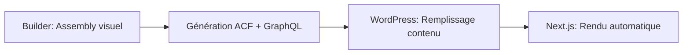

# 🏗️ Headless Builder - CMS Headless + Visual Builder

> Un outil pensé agence qui permet de créer rapidement des sites WordPress headless en assemblant visuellement des composants réutilisables, avec génération automatique des champs ACF et schéma GraphQL.

[]()
[]()

---

## 📋 Table des matières

- [Concept](#-concept-principal)
- [Architecture](#️-architecture-en-3-niveaux)
- [Workflow](#-workflow-type)
- [Avantages](#-avantages-clés)
- [Roadmap](#️-roadmap-de-développement)
- [Stack Technique](#️-stack-technique)
- [Quick Wins](#-quick-wins)
- [Risques](#️-risques--mitigations)
- [Contribution](#-contribution)

---

## 🎯 Concept principal

Un outil pensé agence qui permet de créer rapidement des sites WordPress headless en assemblant visuellement des composants réutilisables, avec génération automatique des champs ACF et schéma GraphQL.

### Problème résolu

- ⏱️ **Gain de temps** : Setup projet divisé par 3-4
- ♻️ **Réutilisabilité** : Une bibliothèque partagée entre tous les projets
- 🎯 **Séparation stricte** : Client = contenu | Agence = design/structure
- 📦 **Cohérence** : Même base de code maintenue pour tous les projets
- 📈 **Scalabilité** : Amélioration d'un composant = bénéfice pour tous

---

## 🏗️ Architecture en 3 niveaux

### 1️⃣ Niveau Agence

**Bibliothèque de composants centralisée**

- Composants "nus" (structure logique uniquement)
- Sans style imposé : Hero, Cards, CTA, Forms, etc.
- Définition des champs éditables pour chaque composant

### 2️⃣ Niveau Client/Projet

**Organisation hiérarchique**

```
Agence
└─ Clients
   └─ Projets
      └─ Pages (assemblées avec composants + styles custom)
```

- Design tokens par projet (couleurs, typo, spacing)
- Assembly visuel des pages avec les composants
- Configuration des champs éditables

### 3️⃣ Niveau WordPress + Next.js

**Automatisation complète**

- Génération auto des ACF field groups
- Export du schéma GraphQL
- Le client remplit uniquement le contenu (textes/images)
- Next.js récupère les données via GraphQL et rend les composants

---

## ✨ Workflow type



1. **Dans le Builder** : Tu assembles visuellement une page, définis les champs éditables
2. **Génération auto** : ACF fields + GraphQL schema créés automatiquement
3. **Dans WordPress** : Le client remplit juste le contenu (aucune gestion de design/layout)
4. **Rendu Next.js** : Query GraphQL → Props composants → Affichage automatique

---

## 💪 Avantages clés

### ✅ Pour l'agence

- Setup projet divisé par 3-4
- Bibliothèque partagée entre tous les projets
- Maintenance centralisée
- Onboarding clients simplifié

### ✅ Pour le client

- Interface simple (contenu uniquement)
- Aucune gestion technique
- Updates automatiques
- Performance optimale

### ✅ vs Concurrence

- **Pensé agence** dès le départ (multi-tenant, hiérarchie client/projet)
- **Composants non-stylés** réutilisables avec design tokens
- **Intégration WordPress native** (ACF + GraphQL automatisés)
- **Plus simple** que Builder.io/Plasmic (focus sur l'essentiel)
- **Potentiel IA** pour accélérer la création

---

## 🗺️ Roadmap de développement

### 🎯 Phase 0 : Validation & Architecture (2-3 semaines)

#### Décisions techniques critiques

**Stack du Builder**

- Frontend : React + TypeScript + TailwindCSS
- Drag & Drop : dnd-kit ou react-beautiful-dnd
- État global : Zustand ou Jotai
- Backend : Node.js + Fastify
- BDD : PostgreSQL + Redis
- Auth : Clerk ou Auth.js

**Architecture des composants**

- Format JSON des composants (schema)
- Système de props typées (Zod pour validation)
- Stratégie de packaging NPM (monorepo avec Turborepo)

**Stack WordPress/Next.js**

- WPGraphQL + ACF extension
- Next.js 15 (App Router)
- Plugin WordPress custom pour sync ACF

#### POC minimal

- [ ] Créer 1 composant "Hero" nu avec 3 champs (titre, texte, image)
- [ ] Builder simple : drag & drop du Hero sur une page
- [ ] Génération JSON des field groups ACF
- [ ] Script d'import dans WordPress (manuel pour le POC)
- [ ] Query GraphQL + rendu Next.js

**🎯 Objectif** : Valider que le concept fonctionne de bout en bout

---

### 🏗️ Phase 1 : MVP - Core Features (2-3 mois)

#### 1.1 - Système d'authentification & Multi-tenant

- [ ] Auth agence (création compte)
- [ ] Gestion clients (CRUD)
- [ ] Gestion projets par client
- [ ] Permissions de base (admin agence / membre)

#### 1.2 - Bibliothèque de composants (Niveau Agence)

- [ ] Interface de gestion des composants
- [ ] Éditeur de composant avec définition des champs
  - Types de base : text, textarea, wysiwyg, image, url, number, true/false
- [ ] 5-6 composants essentiels :
  - Hero, Card, CTA, Form Contact, Gallery, Testimonial
- [ ] Stockage des composants (JSON + BDD)
- [ ] Preview des composants

#### 1.3 - Page Builder (Niveau Projet)

- [ ] Interface drag & drop pour assembler les pages
- [ ] Système de design tokens
  - Colors (primary, secondary, neutral...)
  - Typography (font families, sizes, weights)
  - Spacing (système de padding/margin)
  - Border radius
- [ ] Configuration des champs par instance de composant
- [ ] Preview temps réel avec les design tokens appliqués

#### 1.4 - Génération & Export

- [ ] Générateur de ACF field groups JSON
- [ ] Export du schéma GraphQL
- [ ] Plugin WordPress de base pour importer les ACF fields
- [ ] Documentation d'installation

#### 1.5 - Package NPM des composants

- [ ] Setup monorepo ou registry NPM privé
- [ ] Composants React non-stylés avec props typées
- [ ] Système de theming (CSS variables injectées)
- [ ] Documentation Storybook

**🎯 Objectif** : Pouvoir créer 1 projet complet et le déployer sur WordPress + Next.js

---

### 🚀 Phase 2 : Automation & DX (2 mois)

#### 2.1 - Sync automatique WordPress

- [ ] API REST custom côté WordPress
- [ ] Authentification sécurisée (API keys)
- [ ] Webhook depuis le builder → WordPress
- [ ] Import auto des ACF field groups
- [ ] Gestion des updates (versioning)

#### 2.2 - CLI & Templates Next.js

- [ ] CLI pour bootstrapper un projet Next.js
  ```bash
  npx @ton-agence/create-project mon-projet
  ```
- [ ] Template Next.js préconfiguré
  - WPGraphQL client
  - Composants importés
  - Système de theming
  - Layout de base
- [ ] Script de génération des types TypeScript depuis GraphQL

#### 2.3 - Versioning & Variants

- [ ] Versioning des composants (v1, v2, v3...)
- [ ] Gestion des variants (Hero avec/sans image de fond)
- [ ] Migration automatique lors des updates
- [ ] Lock de version par projet (éviter breaking changes)

#### 2.4 - Advanced Fields

- [ ] Repeater fields
- [ ] Flexible content (sections dynamiques)
- [ ] Relations (lier des posts/pages)
- [ ] Groupe de champs conditionnels

**🎯 Objectif** : Workflow 100% automatisé, de la création à la mise en prod

---

### ⚡ Phase 3 : Scale & Intelligence (2-3 mois)

#### 3.1 - Collaboration & Permissions

- [ ] Roles avancés (admin, designer, dev, client)
- [ ] Commentaires sur les composants/pages
- [ ] Historique des modifications
- [ ] Branches/versions de pages (draft/published)

#### 3.2 - Composants avancés

- [ ] Système de slots (composants imbriqués)
- [ ] Composants conditionnels (affichage selon logique)
- [ ] Animations (intégration Framer Motion)
- [ ] Composants interactifs (carousels, tabs, accordions)

#### 3.3 - IA Assistance

- [ ] Génération de composants depuis description texte
- [ ] Suggestion de composition de page
- [ ] Génération de design tokens depuis capture d'écran
- [ ] Auto-complétion de contenu placeholder

#### 3.4 - Analytics & Optimisation

- [ ] Dashboard d'utilisation des composants
- [ ] Performance monitoring des sites créés
- [ ] A/B testing de variants
- [ ] Suggestions d'optimisation

#### 3.5 - Marketplace

- [ ] Store de composants communautaires
- [ ] Templates de pages prêtes à l'emploi
- [ ] Monétisation possible

**🎯 Objectif** : Produit mature, différencié, avec effet de réseau

---

### 📊 Phase 4 : Growth & Maintenance (continu)

#### 4.1 - Developer Experience

- [ ] Documentation complète (Mintlify ou Docusaurus)
- [ ] Video tutorials
- [ ] Template projects showcase
- [ ] Community Discord/Forum

#### 4.2 - Intégrations tierces

- [ ] Figma → Import composants
- [ ] Vercel/Netlify → Déploiement 1-click
- [ ] Analytics (GA, Plausible)
- [ ] CRM (HubSpot, Salesforce)

#### 4.3 - Internationalization

- [ ] UI multilingue
- [ ] Support WPML/Polylang dans les champs
- [ ] RTL support

#### 4.4 - Business

- [ ] Pricing tiers (Starter, Pro, Enterprise)
- [ ] Billing (Stripe)
- [ ] Onboarding automatisé
- [ ] Customer success

---

## 📊 Métriques de succès par phase

| Phase   | Métrique clé            | Objectif                     |
| ------- | ----------------------- | ---------------------------- |
| Phase 0 | POC fonctionnel         | 1 page complète générée      |
| Phase 1 | Projets créés           | 3-5 projets internes         |
| Phase 2 | Time-to-deploy          | < 2h pour un nouveau projet  |
| Phase 3 | Composants bibliothèque | 50+ composants réutilisables |
| Phase 4 | Clients payants         | 10+ agences utilisatrices    |

---

## 🛠️ Stack Technique

### Frontend Builder

```
├─ React 18 + TypeScript
├─ Vite (build rapide)
├─ TailwindCSS
├─ dnd-kit (drag & drop)
├─ Zustand (state)
└─ React Query (data fetching)
```

### Backend

```
├─ Node.js 20+
├─ Fastify (plus rapide qu'Express)
├─ Prisma (ORM)
├─ PostgreSQL
├─ Redis (cache)
└─ Zod (validation)
```

### Composants

```
├─ Monorepo Turborepo
├─ Changesets (versioning)
├─ Storybook
└─ Vitest (tests)
```

### WordPress

```
├─ Plugin custom
├─ WPGraphQL + ACF extension
└─ REST API custom
```

### Next.js

```
├─ Next.js 15 (App Router)
├─ TypeScript
├─ GraphQL Codegen
└─ CSS Modules ou Tailwind
```

---

## 💡 Quick Wins

Pour démarrer rapidement, voici les étapes prioritaires :

1. **Semaine 1** : POC avec 1 composant Hero
2. **Semaine 2** : Générateur ACF basique
3. **Semaine 3** : Next.js qui consomme le GraphQL
4. **Semaine 4** : Builder drag & drop minimal

**✅ Si ça marche → Full speed sur Phase 1**

---

## ⚠️ Risques & Mitigations

| Risque                      | Impact    | Mitigation                         |
| --------------------------- | --------- | ---------------------------------- |
| Complexité ACF field groups | 🔴 High   | POC pour valider la faisabilité    |
| Lock-in WordPress           | 🟡 Medium | Abstraire derrière une interface   |
| Performance du builder      | 🟡 Medium | Lazy loading, virtualisation       |
| Adoption                    | 🔴 High   | Commencer avec tes propres projets |

---

## ❓ Questions à creuser

- [ ] Système de sync pour créer les ACF fields dans WordPress (webhook/API ?)
- [ ] Versioning des composants pour rétrocompatibilité
- [ ] Types de champs prioritaires (texte, wysiwyg, image, repeater...)
- [ ] Gestion des variantes de composants (Hero v1, v2, v3...)
- [ ] Permissions : qui peut éditer quoi ?
- [ ] Stack technique du builder

---

## 🤝 Contribution

Ce projet est actuellement en phase de conception. Les contributions seront ouvertes une fois le POC validé.

### Workflow de développement

1. Fork le projet
2. Créer une branche feature (`git checkout -b feature/AmazingFeature`)
3. Commit les changements (`git commit -m 'Add some AmazingFeature'`)
4. Push vers la branche (`git push origin feature/AmazingFeature`)
5. Ouvrir une Pull Request

---

## 📝 License

MIT License - voir le fichier [LICENSE](LICENSE) pour plus de détails.

---

## 📧 Contact

**Ton Nom** - [@ton_twitter](https://twitter.com/ton_twitter)

**Project Link**: [https://github.com/ton-username/headless-builder](https://github.com/ton-username/headless-builder)

---

## 🙏 Remerciements

- [Next.js](https://nextjs.org/)
- [WordPress](https://wordpress.org/)
- [WPGraphQL](https://www.wpgraphql.com/)
- [ACF](https://www.advancedcustomfields.com/)
- [React](https://react.dev/)

---

<div align="center">
  
**[⬆ Retour en haut](#️-headless-builder---cms-headless--visual-builder)**

Made with ❤️ by ton agence

</div>
